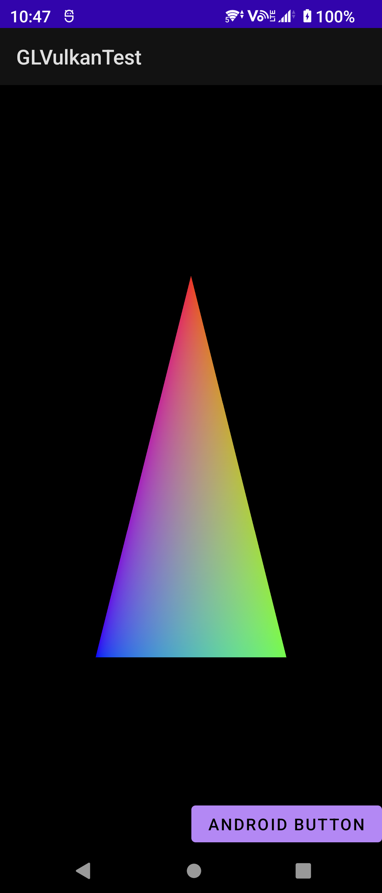

# GLVulkanTest

Vulkan - GLES interop in Android.

* GLES context created with GLSurfaceView.
* Vulkan context created without a swapchain.
* Rendering a triangle to a Vulkan framebuffer.
* Sharing the rendered image with GLES using AHardwareBuffer
* Presenting (blitting) the rendering result using GLES.

